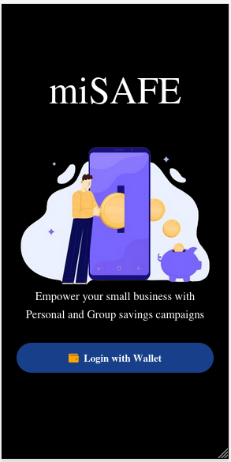
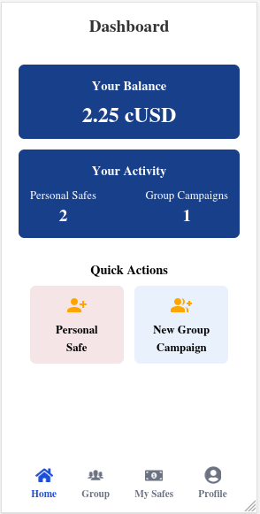
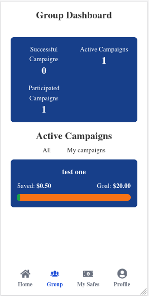
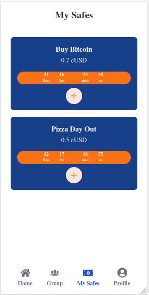

# yoSave

## PROBLEM STATEMENT
Reaching financial goals on an individual basis and collectively as a community can be a daunting challenge, especially when it comes to raising the necessary capital required for succesfully executing the required goal. YoSave is an innovative solution forcused on succesfully tackling this problem.

yoSave allows onchain users to save the agreed upon amounts of  cUSD securely on the celo blockchain using the alfajores tesnetwork.
The app's key features include:

**Time-Locked Savings Vaults**
yoSave's secure savings vaults enable users to lock cUSD funds for a specified duration, providing them the capacity to prevent temptation of using the money way before the exact time it is meant to be used.

**Group Savings Campaigns**
The platform facilitates the creation of collaborative savings campaigns, where individuals can pool their resources together towards a common goal. By working as a community, users can achieve their financial targets more efficiently, quickly and precisely.

## Future Targets
- Onramping and offramping to and from mobile money
- Interest rate earning through liquidity provision to borrowing and lending protocols on the celo blockchain.
- Time-locked group saving campaigns

An Onchain savings platform that empowers individuals and communities to pool their funds together, to achieve their financial goals more effectively and significantly reduce the barrier of access to resources in order to archieve specific goals.

